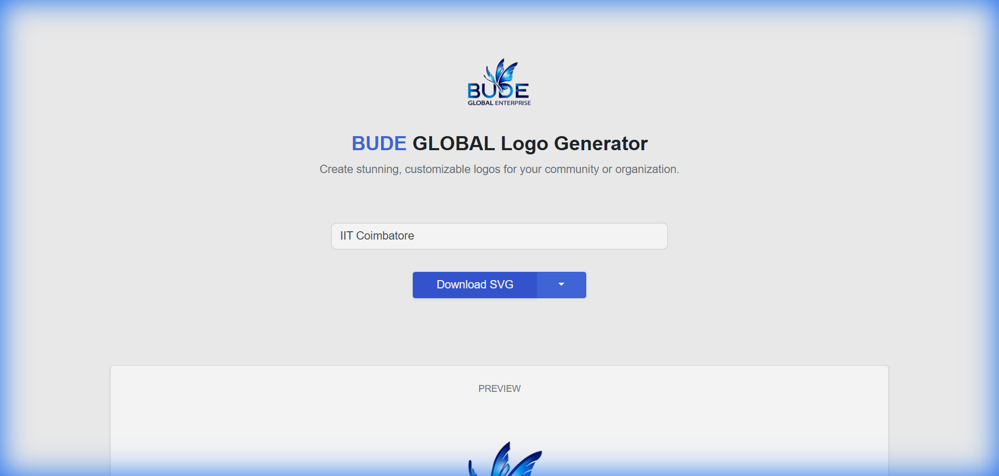

<div align="center">
    
    
# BUDE Logo Generator

[](LICENSE)
[](https://github.com/FOSSUnited/foss-club-logo-generator)
[](https://developer.mozilla.org/en-US/docs/Web/HTML)
[](https://developer.mozilla.org/en-US/docs/Web/CSS)
[](https://developer.mozilla.org/en-US/docs/Web/JavaScript)

**Create stunning, customizable logos for your community or organization in seconds!**

[Live Demo](#) · [Report Bug](../../issues) · [Request Feature](../../issues) · [💬 Join WhatsApp Community](https://chat.whatsapp.com/CkBNXSwAC6lCBNtHT7XqLt)

</div>

## 🖼️ Preview

<div align="center">
  
</div>

---

> [!NOTE]
> This project is a fork of [FOSS United's Campus Logo Generator](https://github.com/FOSSUnited/foss-club-logo-generator), adapted and enhanced for BUDE Global Enterprise. We extend our gratitude to the FOSS United Foundation for their original work.

---

## ✨ Features

- 🎨 **Real-time Preview** - See your logo update as you type
- 🌓 **Dark/Light Mode** - Switch between themes instantly
- 📥 **Multiple Formats** - Download as SVG or PNG
- 📱 **Responsive Design** - Works on desktop and mobile devices
- ⚡ **No Dependencies Runtime** - Pure vanilla JavaScript, no frameworks needed
- 🎯 **One-Click Download** - Generate and save your logo instantly

---

## 💖 Support Us

If you find this project helpful, consider supporting our work!

<div align="center">


**Scan to donate via Google Pay**

</div>

---

## 🚀 Getting Started

### Prerequisites

- Any modern web browser (Chrome, Firefox, Safari, Edge)
- A local web server (optional, for development)

### Installation

1. **Clone the repository**
   ```bash
   git clone https://github.com/BUDEGlobalEnterprise/bude-logo-generator.git
   cd bude-logo-generator
   ```

2. **Open in browser**
   
   Simply open `index.html` in your browser, or use a local server:
   ```bash
   # Using Python
   python -m http.server 8080
   
   # Using Node.js
   npx serve .
   
   # Using VS Code
   # Install "Live Server" extension and click "Go Live"
   ```

3. **Start creating logos!**
   - Enter your college/community name in the input field
   - Toggle between light and dark modes
   - Select your preferred format (SVG or PNG)
   - Click "Download" to save your logo

---

## 📖 Usage Guide

### Creating Your Logo

1. **Enter Name**: Type your college or community name in the input field
2. **Choose Theme**: Click "Switch to Dark" or "Switch to Light" to change the color scheme
3. **Select Format**: Use the dropdown to choose between SVG (vector) or PNG (raster)
4. **Download**: Click the download button to save your customized logo

### Format Recommendations

| Format | Best For | File Size | Scalability |
|--------|----------|-----------|-------------|
| **SVG** | Print materials, large displays, websites | Smaller | Infinite |
| **PNG** | Social media, presentations, documents | Larger | Fixed resolution |

---

## 📁 Project Structure

```
bude-logo-generator/
├── index.html          # Main application file
├── README.md           # This file
├── LICENSE             # MIT License
├── CONTRIBUTING.md     # Contribution guidelines
├── CODE_OF_CONDUCT.md  # Community code of conduct
├── CHANGELOG.md        # Version history
├── assets/
│   ├── favicon/        # Browser tab icons
│   └── *.svg, *.png    # Logo assets
├── scripts/
│   └── main.js         # Application logic
└── styles/
    └── main.css        # Styling
```

---

## 🛠️ Tech Stack

| Technology | Purpose |
|------------|---------|
| **HTML5** | Structure and SVG embedding |
| **CSS3** | Styling and responsive design |
| **JavaScript** | Interactivity and download logic |
| **Bootstrap 4** | UI components and layout |
| **Font Awesome 4** | Social media icons |

---

## 🤝 Contributing

Contributions make the open-source community amazing! See our [Contributing Guidelines](CONTRIBUTING.md) for how to get started.

### Quick Start for Contributors

1. Fork the repository
2. Create a feature branch: `git checkout -b feature/amazing-feature`
3. Make your changes
4. Commit: `git commit -m 'Add amazing feature'`
5. Push: `git push origin feature/amazing-feature`
6. Open a Pull Request

---

## 🗺️ Roadmap

- [ ] Add more logo templates
- [ ] Support for custom colors
- [ ] Add text customization (font, size, position)
- [ ] Generate social media sized assets
- [ ] Add watermark option
- [ ] Multiple language support

See the [open issues](../../issues) for a full list of proposed features.

---

## 📝 Changelog

See [CHANGELOG.md](CHANGELOG.md) for a history of changes.

---

## ©️ License

This project is licensed under the **MIT License** - see the [LICENSE](LICENSE) file for details.

### What This Means

✅ **You can:**
- Use commercially
- Modify and distribute
- Use privately
- Sublicense

❌ **You cannot:**
- Hold us liable
- Use our trademarks without permission

📝 **You must:**
- Include the original license
- Include copyright notice

**Original Work:** Copyright © 2023 FOSS United Foundation  
**Fork:** Copyright © 2024 BUDE Global Enterprise

---

## 📜 Terms and Conditions

By accessing and using this service, you agree to be bound by our [Terms and Conditions](https://budeglobal.in/terms).

---

## 🙏 Acknowledgments

Special thanks to:

- **[FOSS United Foundation](https://fossunited.org/)** - For the original Campus Logo Generator project
- **[TinkerHub](https://github.com/tinkerhub/campus-logo-generator)** - For design inspiration
- **[Bootstrap](https://getbootstrap.com/)** - For the amazing UI framework
- **[Font Awesome](https://fontawesome.com/)** - For the beautiful icon system
- **Bude Global Community** - For contributing feedback and suggestions
- **All Contributors** - Thank you for making this project better!

---

## � Contact

**Bude Global Enterprise**

| Platform | Link |
|----------|------|
| 🌐 **Website** | [budeglobal.in](https://budeglobal.in) |
| 📝 **Blog** | [blog.budeglobal.in](https://blog.budeglobal.in) |
| 💼 **LinkedIn** | [linkedin.com/company/budeglobal](https://linkedin.com/company/budeglobal) |
| 🐙 **GitHub** | [github.com/BUDEGlobalEnterprise](https://github.com/BUDEGlobalEnterprise) |
| 📺 **YouTube** | [@BudeGlobalEnterprise](https://youtube.com/@BudeGlobalEnterprise) |
| 🐦 **Twitter/X** | [@budeglobalerp](https://twitter.com/budeglobalerp) |
| 📷 **Instagram** | [@budeglobal](https://instagram.com/budeglobal) |

---

## 💬 Support

| Channel | Link |
|---------|------|
| 🐛 **Bug Reports** | [GitHub Issues](../../issues) |
| 💬 **Discussions** | [GitHub Discussions](../../discussions) |
| 📱 **WhatsApp Community** | [Join our WhatsApp Group](https://chat.whatsapp.com/CkBNXSwAC6lCBNtHT7XqLt) |
| 📧 **Email** | [budeglobalerp@gmail.com](mailto:budeglobalerp@gmail.com) |

---

<div align="center">

⭐ **Star this repository if you find it helpful!**

---

**Made with ❤️ by [Bude Global Enterprise](https://budeglobal.in)**

*Empowering developers through open collaboration*

---

**[⬆ Back to Top](#bude-logo-generator)**

</div>
